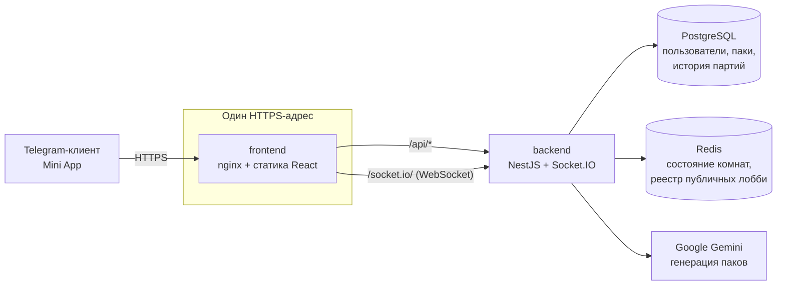

# GuessAI

Реалтайм-викторина, живущая внутри Telegram: комнаты на несколько игроков,
вопросы, которые генерирует Gemini, серии правильных ответов и рейтинг ELO.
Открывается как Telegram Mini App — устанавливать нечего.

> Real-time multiplayer quiz as a Telegram Mini App — NestJS, Socket.IO, Redis, React 19, ELO, AI packs

---

## Что умеет

**Игра**

- Комнаты на несколько игроков: публичные (находятся через «Быструю игру») и
  приватные — по шестизначному коду или диплинку `t.me/<бот>?startapp=<код>`.
- Раундами управляет сервер: у всех игроков вопрос открывается и закрывается
  синхронно, клиент не может ни ускорить раунд, ни подсмотреть ответ.
- **Комбо-серия:** каждый правильный ответ подряд повышает множитель очков
  до ×2. Ошибка и пропуск обнуляют серию.
- **Настройки партии:** хост выбирает в лобби число вопросов (5/10/15/весь пак)
  и время на ответ (10/15/20/30 секунд).
- **Реванш** одной кнопкой и смена пака прямо в лобби — вторая партия не идёт
  по тем же вопросам.
- **Тренировка** — игра в одиночку без рейтинга, чтобы посмотреть пак.
- Выход в меню посреди партии не спасает от проигрыша: очки замирают, игрок
  доигрывает заочно и попадает в пересчёт рейтинга.

**Вопросы**

- Собственные паки: заголовок, категория, приватность, вопросы с четырьмя
  вариантами и пояснением.
- **Генерация через Google Gemini** по одной теме — с фильтром тем и
  модерацией результата.
- Озвучка вопроса через Google TTS.

**Прогресс**

- Рейтинг ELO для матчей на нескольких игроков (`K = 32`, старт 1000).
- Глобальный лидерборд с закреплённой строкой собственного места.
- История партий, счётчики игр и побед.

**Интеграция с Telegram**

- Авторизация по подписанной `initData` — пароля нет, аккаунт берётся из Telegram.
- Тема оформления наследуется от клиента: приложение выглядит нативно
  и в светлой, и в тёмной.
- Системная кнопка «назад», тактильная отдача, шэринг результата в Stories.

---

## Как это устроено



Ключевое решение: **API живёт на том же origin, что и страница.** nginx контейнера
фронта проксирует `/api` и `/socket.io` на бэкенд, поэтому адрес бэкенда не
попадает в бандл, туннель нужен ровно один, а смена его адреса не требует
пересборки фронта.

Второе: **правильные ответы не покидают сервер** до конца раунда. Полное
состояние комнаты с вопросами лежит только в Redis, наружу уходит урезанный
`PublicRoomState` через единственный сериализатор.

---

## Быстрый старт

Нужны Docker с Compose и — для запуска внутри Telegram — `cloudflared`.

```bash
git clone <репозиторий> guessai && cd guessai

cp .env.example .env     # заполнить JWT_SECRET, GEMINI_API_KEY, TELEGRAM_BOT_TOKEN,
                         # DB_USER / DB_PASSWORD / DB_NAME и VITE_BOT_USERNAME
docker compose up -d     # фронт на :8080, API на :3000, Postgres и Redis рядом
```

Приложение уже открывается на `http://localhost:8080`, но Telegram пускает
Mini App только по HTTPS, поэтому для настоящей проверки нужен туннель:

```bash
./scripts/tunnel.sh      # поднимет туннель и напечатает адрес
```

Полученный адрес вставить в BotFather: *Bot Settings → Configure Mini App*.
Без этого шага диплинки `startapp` не работают. Адрес quick-туннеля живёт,
пока жив процесс, — при следующем запуске шаг придётся повторить.

Разработка по частям, отладка вне Telegram и запуск без Docker — в README
соответствующих каталогов.

---

## Структура репозитория

```
├── backend/          NestJS: REST, WebSocket-гейтвей, игровой цикл, Prisma
├── frontend/         React 19 + Vite: Telegram Mini App
├── scripts/
│   └── tunnel.sh     один Cloudflare-туннель на фронт + подсказка для BotFather
├── docker-compose.yaml
├── .env.example      все переменные с комментариями
└── CONTRACT.md       контракт REST + WebSocket — источник правды
```

## Документация

| Файл | О чём |
|---|---|
| [`backend/README.md`](backend/README.md) | Модули, переменные окружения, игровой цикл, ограничения масштабирования |
| [`frontend/README.md`](frontend/README.md) | Запуск, отладка вне Telegram, структура, правила экранов |

---

## Правила игры

**Очки за раунд**

```
base   = 100 + floor(100 × оставшееся время / длительность раунда)
mult   = [1, 1.25, 1.5, 2][min(серия до этого ответа, 3)]
gained = верный ответ ? floor(base × mult) : 0
```

Мгновенный ответ без серии — около 200 очков, на последней секунде — около 100.
На серии из четырёх и длиннее множитель упирается в ×2, то есть мгновенный
ответ доходит до 400. Серию обнуляет и ошибка, и пропуск раунда: промолчать
не должно быть выгоднее, чем рискнуть и промахнуться.

**Рейтинг**

ELO для N игроков: каждый сравнивается с каждым, `K = 32`, стартовый рейтинг
1000, нижняя граница 100. Тренировки и партии, где не было соперника, рейтинг
не меняют и в счётчики игр и побед не попадают, но остаются в истории.

---

## Стек

| Слой | Технологии |
|---|---|
| Бэкенд | NestJS 11, TypeScript, Socket.IO 4, Prisma 7 |
| Хранилища | PostgreSQL 16 (постоянные данные), Redis (состояние комнат, TTL 2 часа) |
| Фронтенд | React 19, Vite, zustand, react-router 7, CSS Modules |
| Telegram | `@telegram-apps/sdk-react` с фолбэком на `window.Telegram.WebApp` |
| ИИ и звук | Google Gemini, Google TTS |
| Окружение | Docker Compose, nginx, Node 22 |

---

## Осознанные ограничения

Это не список багов — так решено намеренно, с записанной ценой.

- **Таймеры раундов живут в памяти процесса.** Один инстанс это выдерживает,
  но рестарт бэкенда посреди партии оставляет раунд незакрытым, а горизонтальное
  масштабирование потребует BullMQ и `@socket.io/redis-adapter`. Подробности —
  в [`backend/README.md`](backend/README.md).
- **Озвучка — хотлинк на Google TTS**, без собственного кеша аудио. Работает
  только потому, что в `frontend/index.html` стоит
  `<meta name="referrer" content="no-referrer">`: с заголовком `Referer` Google
  отдаёт 404 на любой запрос.
- **Quick-туннель Cloudflare меняет адрес при каждом запуске**, поэтому URL
  приходится обновлять в BotFather вручную. Убрать этот шаг может только
  именованный туннель, а он требует своего домена.
- **Автотестов нет.** Проверки выполнялись сценарными прогонами по сокету и
  браузеру против живого стека.
